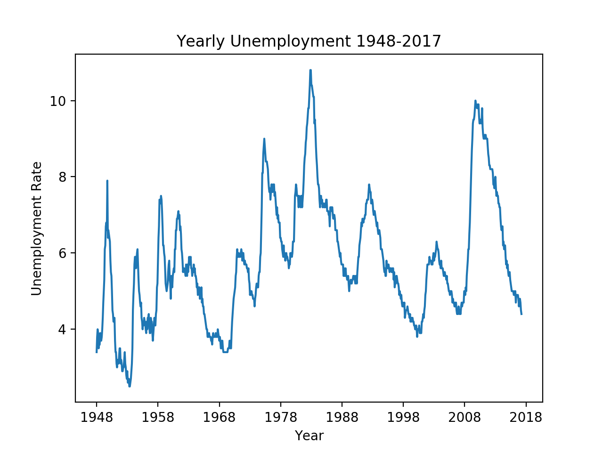
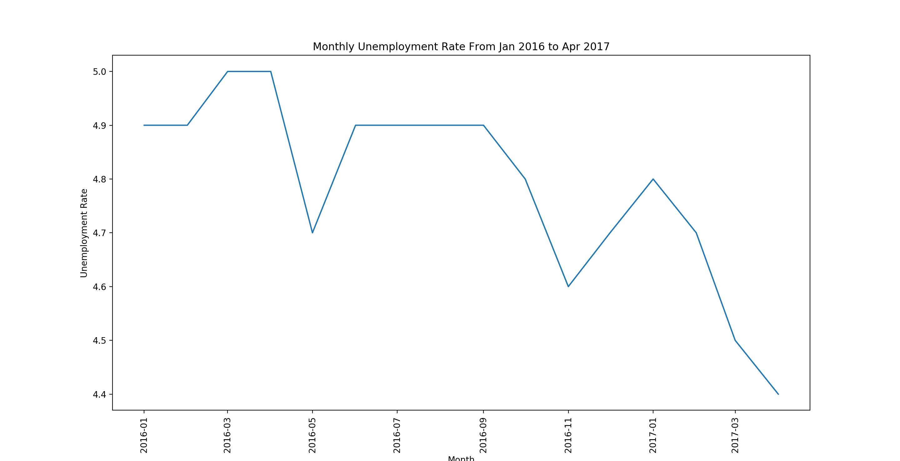

# simple_viz_unemployment_rate
very simple visual representation of US unemployment rate 1948-2017

# Data
Federal Reserve bank of St. Louis. https://fred.stlouisfed.org/series/UNRATE

# Usage
`python simple_viz_un_rate.py`

# Analysis
Yearly unemployment rate

Monthly from Jan 2016 to Apr 2017

